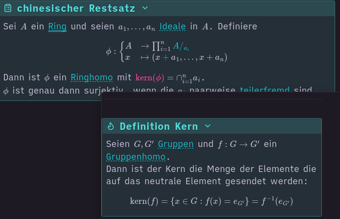

# obsidian mathlinks

This is a plugin that enables links in obsidian math blocks.
The usage is `\href{file}{math}` where `file` is the file to be referenced and `math` is the equation that should be a link. See also  https://docs.mathjax.org/en/latest/input/tex/extensions/html.html.

The links function the same way as obsidian links, i.e. they show a popup when hovered and are clickable.

# Screenshot



The code to this block is the following:
```
[!abstract]+ chinesischer Restsatz
> Sei $A$ ein [[Ring]] und seien $a_1, ..., a_n$ [[Ideal|Ideale]] in $A$. Definiere
> $$ \phi : \begin{cases} A & \rightarrow \prod_{i=1}^n  \href{Faktorgruppe}{A/_{a_i}} \\ x & \mapsto (x\href{Nebenklasse}{+} a_1, ..., x + a_n) \end{cases} $$
> Dann ist $\phi$ ein [[Ringhomomorphismus|Ringhomo]] mit $\href{Kern}{\text{kern}(\phi)} = \cap_{i=1}^n a_i$.
> $\phi$ ist genau dann surjektiv, wenn die $a_i$ paarweise [[Ideal_teilerfremd|teilerfremd]] sind.
```
